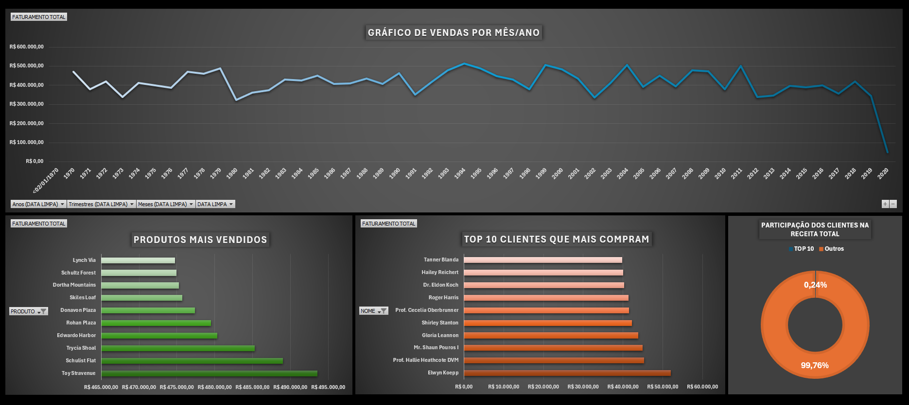

# 📊 Dashboard de Vendas em Excel

## 📌 Sobre o Projeto

Este projeto consiste na construção de um dashboard interativo no Excel para análise de vendas, com foco em visualização de dados e geração de insights.

## 🔍 Análises Realizadas

* Faturamento ao longo do tempo (mensal/anual)
* Produtos mais vendidos
* Top 10 clientes
* Análise de concentração de receita (Top clientes vs base geral)

## 🛠️ Ferramentas Utilizadas

* Microsoft Excel
* Tabelas Dinâmicas
* Gráficos (linha, barras e rosca)

## 📈 Principais Insights

* Identificação dos produtos com maior faturamento
* Ranking dos clientes mais relevantes
* Baixa concentração de receita (Top clientes representam pequena parcela do total)

## 📸 Dashboard

## 🚀 Autor

Jocival Almeida
